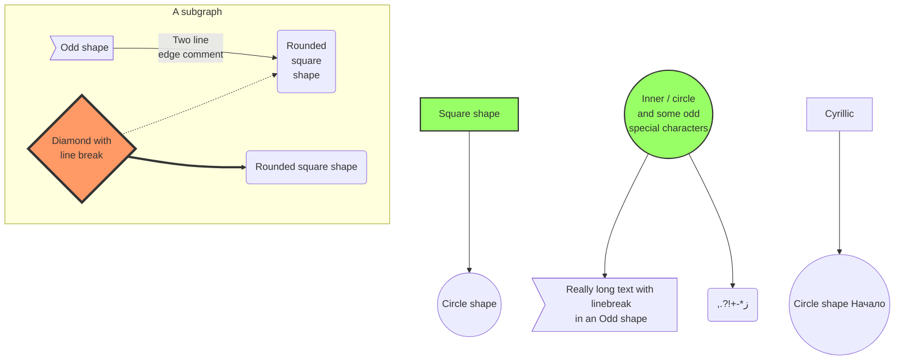
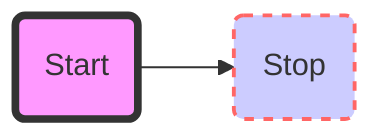
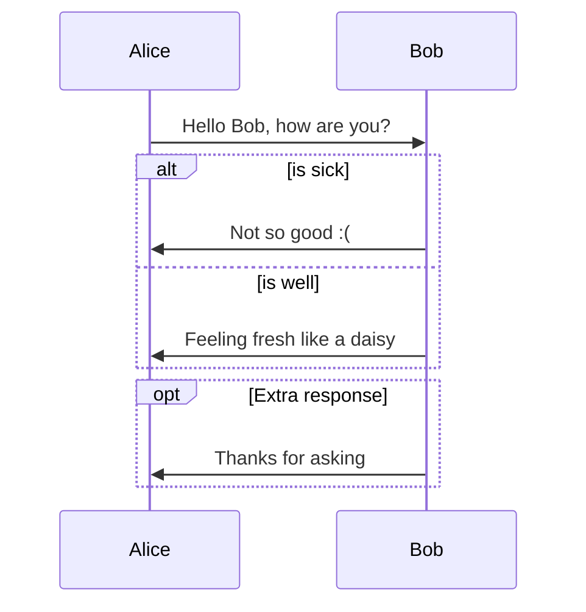
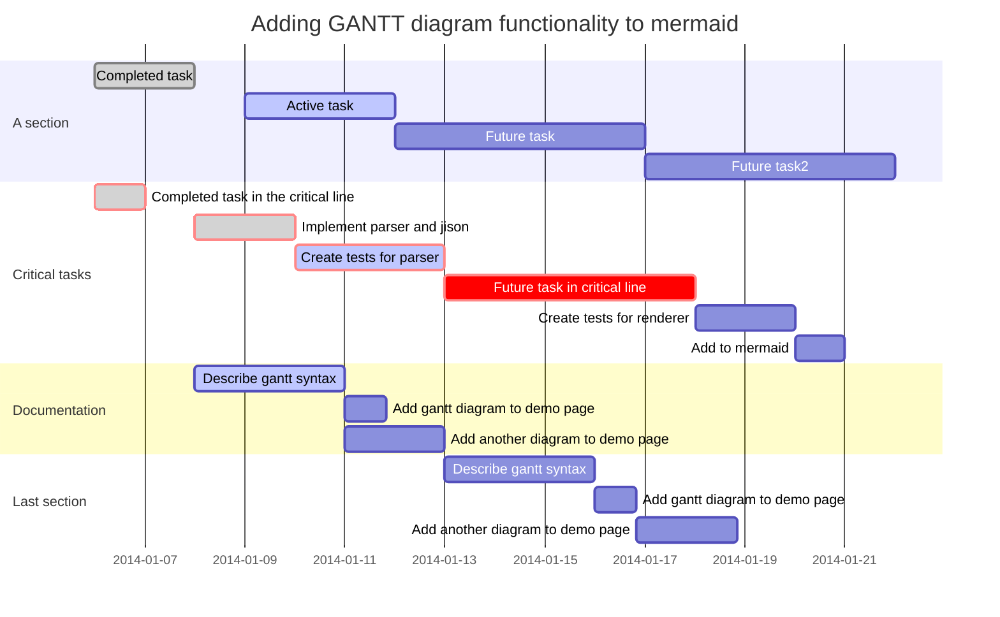

class: center, middle

# Title

$$e^{i\pi} + 1 = 0$$

---

class: right, bottom
background-image: url(http://xn--ch-hb4asdqa9qoa0d7mp880csfpb.com/wp-content/uploads/2015/11/aikatu-e1447662428861.jpg)
background-size: 100%

---

# Section

```python
def test(a,b):
*    return a + b

print(test(1,3))
print('hello world')

```

---

class: center, middle

# TeX Test

# \\(\KaTeX{}\\) in remark

---

# Display and Inline

1. This is an inline integral: \\(\int_a^bf(x)dx\\)
2. More \\(x={a \over b}\\) formulae.

Display formula:

$$e^{i\pi} + 1 = 0$$

---

class: center, middle




---

class: center, middle




---

class: center, middle




---

class: center, middle



